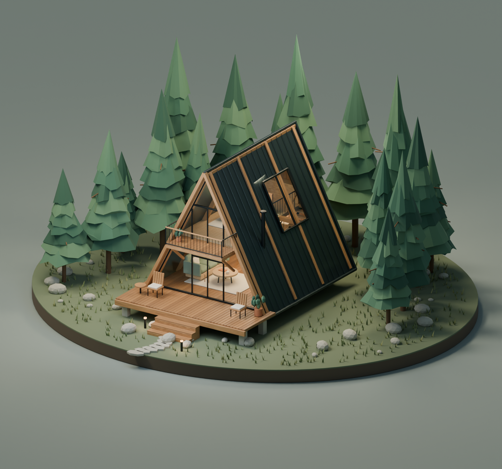

# Blender Models

我的 Blender 模型作品集。每个模型独立存放，包含可编辑的 `.blend` 源文件、渲染预览，以及可用的生成脚本和使用说明。

## 模型目录

| 模型 | 内容 | Blender 版本 |
| --- | --- | --- |
| [林间三角屋 · PINE / 02](models/forest-cabin/) | 两层 A 字形林间小屋，含室内、楼梯、阳台、露台及松林 | 5.1 |

### 林间三角屋 · PINE / 02



[模型与使用说明](models/forest-cabin/) · [下载 .blend 文件](models/forest-cabin/林间三角屋.blend) · [建筑特写](models/forest-cabin/林间三角屋_建筑特写.png) · [两层剖视](models/forest-cabin/林间三角屋_两层剖视.png)

## 使用

克隆仓库，使用相应版本的 Blender 打开模型目录中的 `.blend` 文件：

```bash
git clone https://github.com/jasonleecode/blender-models.git
cd blender-models
```

每个模型的具体操作、材质依赖和脚本运行方式见其目录内的 `README.md`。

## 添加新模型

在 `models/` 下新建一个目录，并更新上方模型目录：

```text
models/
└── model-name/
    ├── README.md        # 模型说明、Blender 版本和操作方式
    ├── model.blend      # 可编辑源文件
    ├── preview.png      # 渲染预览
    └── create_model.py  # 生成脚本（如有）
```

贴图等外部资源应随模型提交或打包到 `.blend` 文件中，以便在其他电脑上正常打开。
